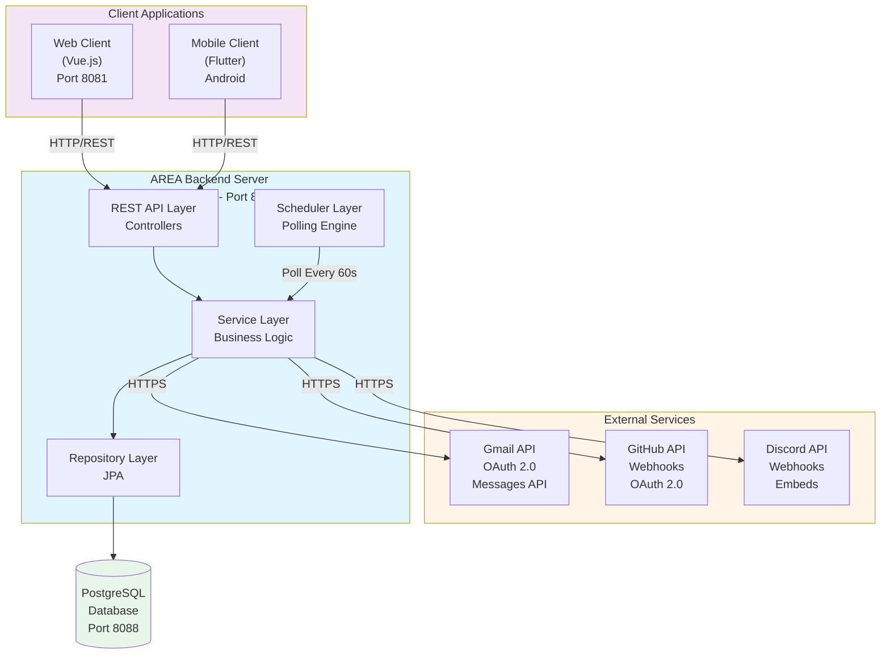
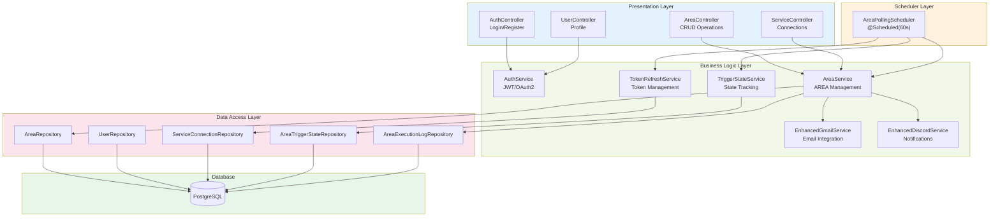
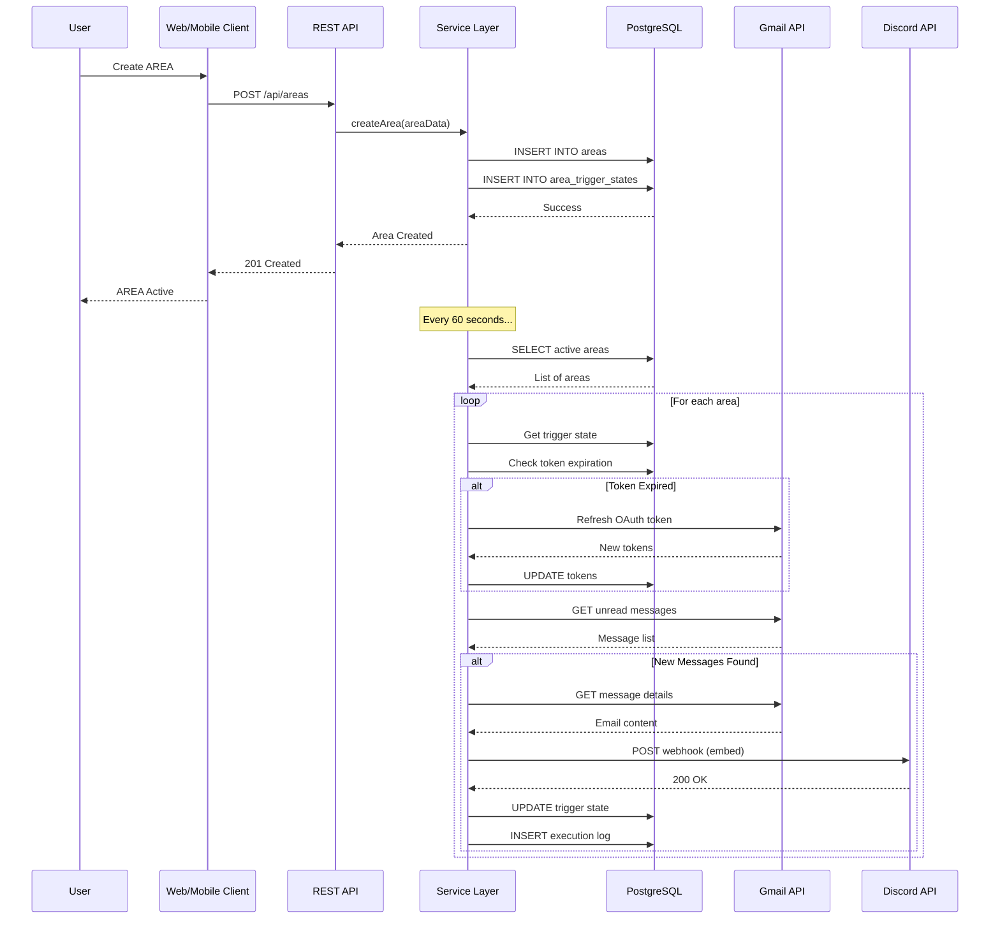
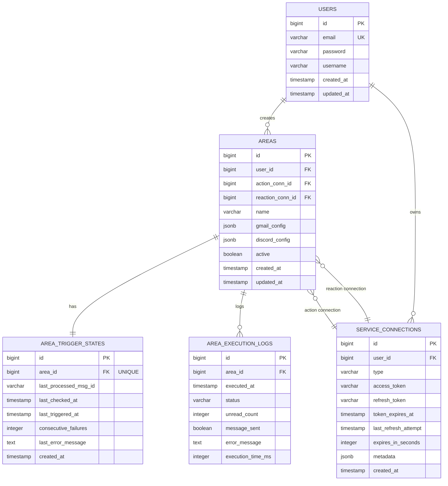
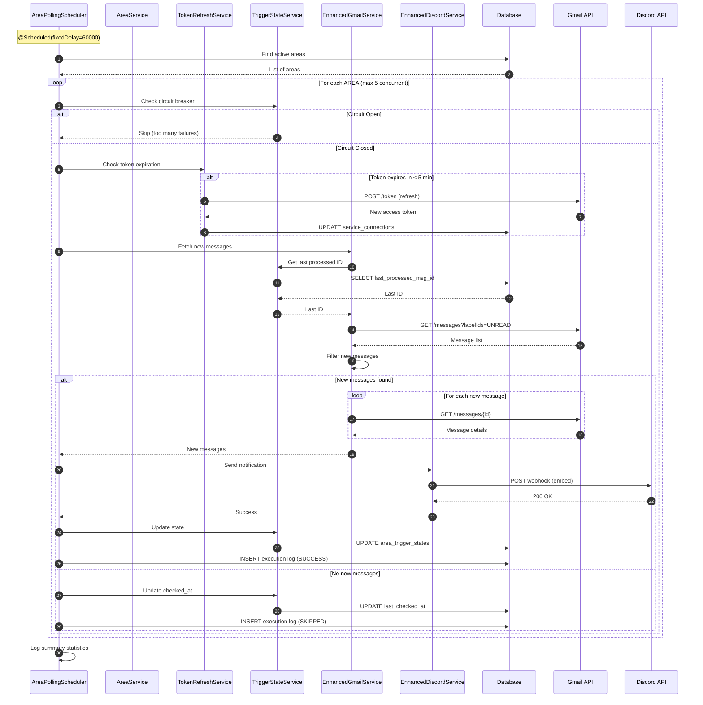
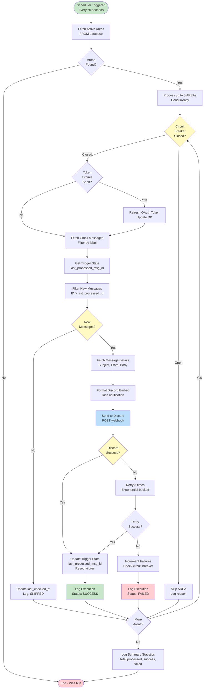
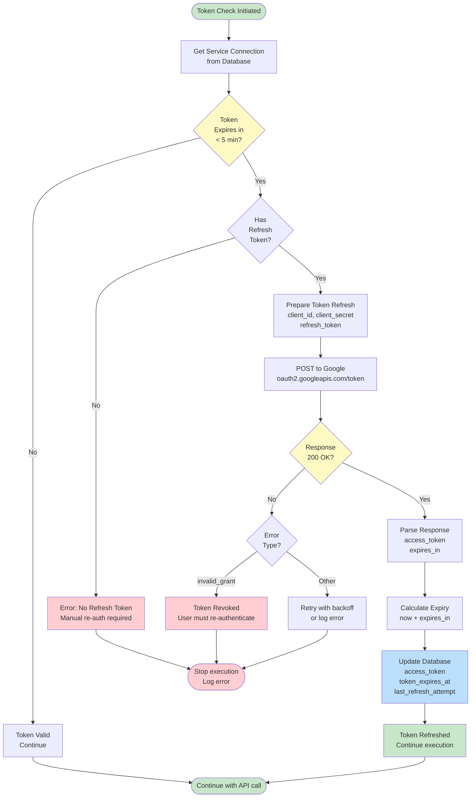
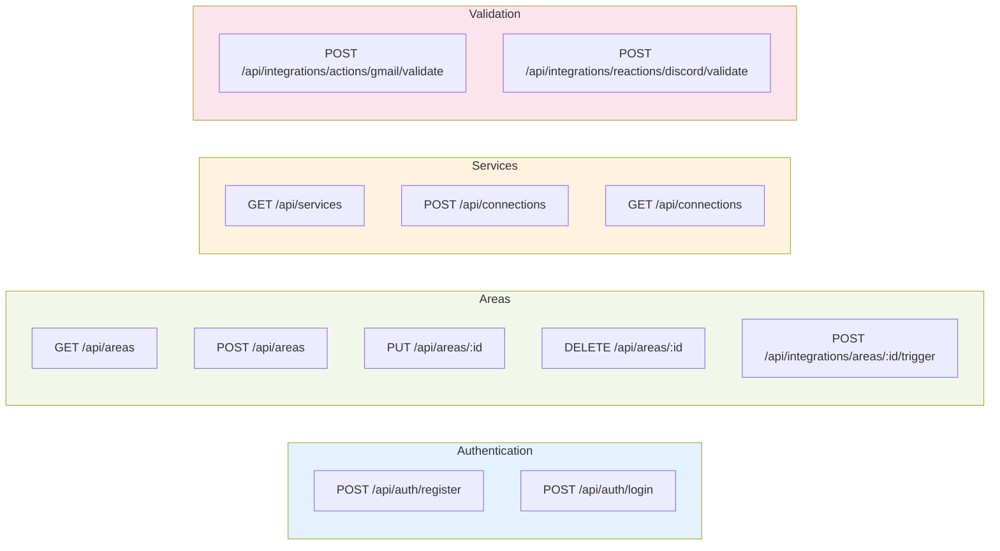
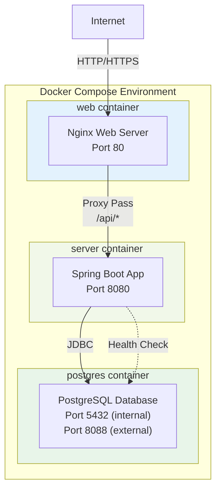

# AREA Platform - System Architecture Diagrams

This document provides comprehensive system architecture diagrams for the AREA platform using Mermaid.

## Table of Contents

1. [High-Level Architecture](#high-level-architecture)
2. [Component Architecture](#component-architecture)
3. [Data Flow Diagram](#data-flow-diagram)
4. [Database Schema](#database-schema)
5. [Execution Flow Sequence](#execution-flow-sequence)
6. [Scheduler Process Flow](#scheduler-process-flow)
7. [Token Refresh Flow](#token-refresh-flow)

---

## High-Level Architecture



---

## Component Architecture



---

## Data Flow Diagram



---

## Database Schema



---

## Execution Flow Sequence



---

## Scheduler Process Flow



---

## Token Refresh Flow



---

## Key Components Explained

### Scheduler Configuration
```yaml
Polling Interval: 60 seconds
Concurrent Processing: Up to 5 AREAs
Timeout Protection: 2 minutes maximum
Initial Delay: 30 seconds after startup
Thread Pool Size: 5 threads
```

### Circuit Breaker Rules
- **Opens After**: 5 consecutive failures
- **Purpose**: Prevent wasting resources on broken AREAs
- **Reset**: Manual intervention required (fix configuration)

### Token Refresh Strategy
- **Check Threshold**: 5 minutes before expiration
- **Proactive**: Prevents mid-execution token expiry
- **Automatic**: No user intervention needed
- **Fallback**: Requires re-authentication if refresh fails

### Discord Retry Logic
- **Max Retries**: 3 attempts
- **Backoff**: Exponential (1s, 2s, 4s)
- **Timeout**: 10 seconds per request
- **Rate Limiting**: Respects Discord's limits

---

## API Endpoints Reference



---

## Deployment Architecture



---

*Generated: December 2025*
*For more details, see the complete documentation in `/docs`*
